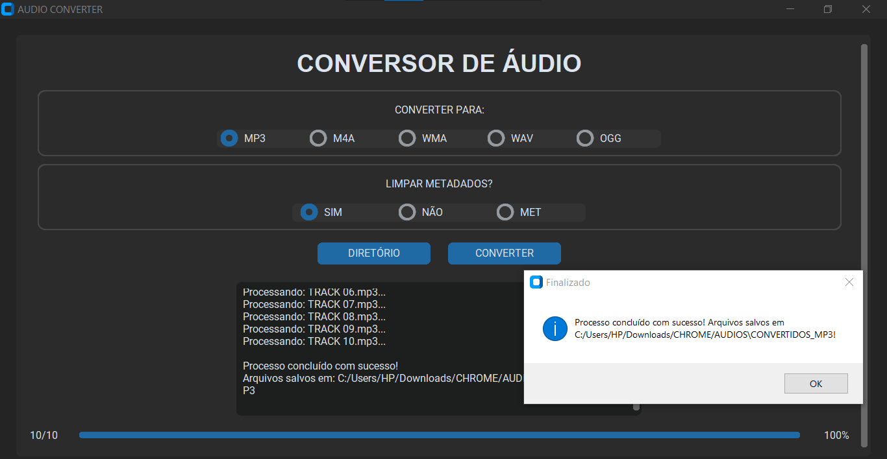
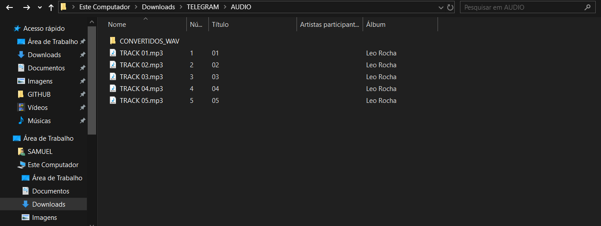
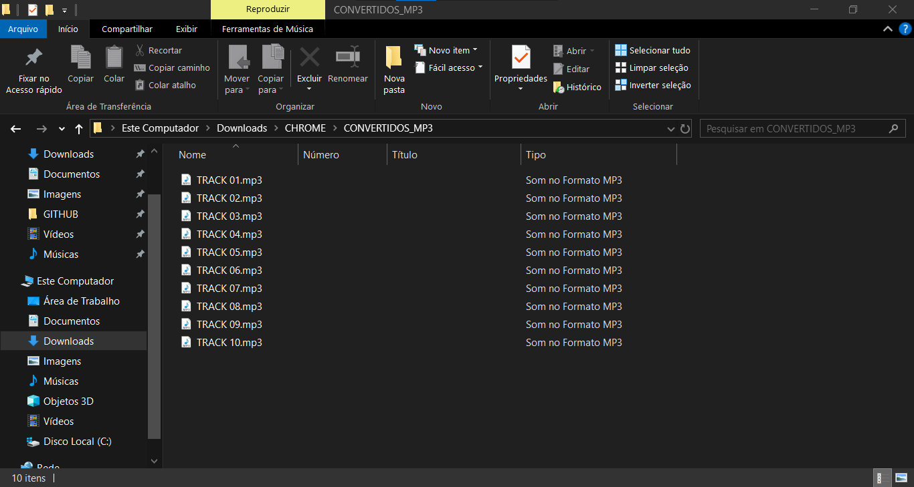

# AUDIO CONVERTER
📱ESTE APLICATIVO CONVERTE AUTOMATICAMENTE ARQUIVOS DE ÁUDIO PARA UM FORMATO ESCOLHIDO PELO USUÁRIO (COMO .MP3, .WAV, .OGG, ETC.) USANDO O FFMPEG.

 <br>
 <br>
 <br>

## DESCRIÇÃO:
Este aplicativo converte automaticamente arquivos de áudio de diversos formatos (como `.wav`, `.ogg`, `.flac`, `.aac`, `.m4a`, `.wma`, `.alac`, `.opus`, `.mp4`, `.mov`, e `.mp3`) para um formato escolhido pelo usuário (por padrão, `.mp3`), utilizando a poderosa ferramenta `ffmpeg`.

É especialmente útil para tornar arquivos compatíveis com qualquer dispositivo de áudio — como aparelhos antigos, carros, players portáteis e celulares que aceitam apenas formatos tradicionais.

## FUNCIONALIDADES:
* **Interface gráfica moderna (tema escuro)** com `customtkinter`.
* **Executa em tela maximizada** e permite redimensionamento da janela.
* **Seleção de diretório** contendo os arquivos de áudio.
* **Escolha do formato de saída** entre: MP3, WAV, OGG, FLAC, AAC, M4A, WMA, OPUS e ALAC.
* **Botões de seleção de formato exibidos horizontalmente**, centralizados dentro de um contêiner com borda visual elegante.
* **Conversão automática**, inclusive de arquivos `.mp3` modernos que podem não funcionar em todos os dispositivos.
* **Criação de uma nova pasta** chamada `CONVERTIDOS_<FORMATO>` para salvar os arquivos convertidos.
* **Área de status com logs em tempo real**, exibindo o progresso da conversão e mensagens do `ffmpeg`.
* **Mantém a mensagem do diretório selecionado** visível mesmo após limpar o campo de status.
* **Exibe o caminho de saída ao final da conversão**, informando onde os arquivos foram salvos.
* **Mensagens de erro e alertas amigáveis**, caso nenhum arquivo válido seja encontrado ou o diretório não tenha sido selecionado.
* **Barra de progresso com contagem de arquivos convertidos e percentual concluído**.

## COMO USAR?
1. **Instale as bibliotecas necessárias:** Antes de executar o app, certifique-se de instalar todas as dependências necessárias. No terminal, execute o seguinte comando para instalar as dependências listadas no arquivo requirements.txt em `CODIGO`:
   ```bash
   pip install -r requirements.txt
   ```

2. **Instalar `ffmpeg`:** O App depende da ferramenta externa chamada `ffmpeg` para converter os arquivos de áudio.

   1. **Baixar `ffmpeg`:**
      - Vá para o site oficial: [https://ffmpeg.org/download.html](https://ffmpeg.org/download.html).
      - Na seção de downloads, clique em "Windows builds from gyan.dev" ou um equivalente.
      - Baixe o arquivo ZIP de uma versão estável, por exemplo: `ffmpeg-git-full.7z`.

   2. **Extrair o `ffmpeg`:**
      - Extraia o conteúdo do arquivo baixado para uma pasta em seu computador, como `C:\ffmpeg`.

   3. **Adicionar `ffmpeg` ao caminho (PATH):**
      - Abra o **Painel de Controle** e vá para **Sistema e Segurança** > **Sistema** > **Configurações avançadas do sistema**.
      - Clique em **Variáveis de Ambiente**.
      - Em **Variáveis de Sistema**, selecione a variável **Path** e clique em **Editar**.
      - Adicione uma nova entrada com o caminho completo para a pasta `bin` dentro da pasta onde você extraiu o `ffmpeg`, por exemplo: `C:\ffmpeg\bin`.
      - Clique em **OK** e feche as janelas.

   4. **Verificar a instalação:**
      - Abra o Prompt de Comando e digite `ffmpeg` para verificar se está funcionando corretamente. Você deve ver uma lista de comandos suportados se tudo foi configurado corretamente.

3. **Executar o APP:**
   * No diretório `./CODIGO`, execute o aplicativo com o comando:

   ```bash
   python CODIGO.py
   ```

4. A janela abrirá automaticamente **maximizada**.

5. Clique no botão **"DIRETÓRIO"** e selecione a pasta que contém os arquivos de áudio que deseja converter. O caminho selecionado será exibido na caixa de status e permanecerá visível durante todo o processo.

6. Escolha o formato de saída desejado nos **botões horizontalmente centralizados dentro da área “FORMATO DE SAÍDA:”** (ex: MP3, WAV, OGG, etc.).

7. Clique no botão **"CONVERTER"** para iniciar a conversão. Isso limpará os logs anteriores, mas manterá visível o diretório selecionado.

8. Acompanhe os detalhes do processo na **caixa de status**, que exibe logs em tempo real do `ffmpeg`, incluindo os arquivos sendo convertidos e qualquer mensagem técnica relevante.

9. Ao final, será exibida uma mensagem confirmando que a conversão foi concluída, **junto com o caminho da pasta onde os arquivos convertidos foram salvos**.

10. Os arquivos convertidos estarão em uma subpasta chamada **`CONVERTIDOS_<FORMATO>`** (ex: `CONVERTIDOS_MP3`) criada automaticamente dentro do diretório selecionado.

## SOBRE O EXECUTAVEL E O INSTALADOR:
### 1. EXECUTANDO:
   * O instalador está disponível  em `./APP`. Para instala-lo, basta dar dois cliques e seguir as orientações na tela. 

### 2. GERANDO O EXECUTAVEL:
   **1. Instalação do PyInstaller:**
   * Certifique-se de ter o PyInstaller instalado. Se não tiver, instale usando o comando abaixo:
   ```bash
   pip install pyinstaller
   ```

   **2. Gerando o Executável:**
   * No diretório `./CODIGO`, utilize o comando abaixo para gerar o executável:

   ```bash
   pyinstaller EXECUTAVEL.spec
   ```

   * O executável `AUDIO CONVERTER.exe` será criado na pasta `./CODIGO/dist`.
   * Após a geração, você pode excluir a pasta `./CODIGO/build`.

### 3. GERANDO O INSTALADOR:
#### PASSO 1: BAIXAR E INSTALAR O INNO SETUP:
1. **Download**: Baixe o Inno Setup do site oficial: [Inno Setup](http://www.jrsoftware.org/isdl.php).
2. **Instalação**: Siga o assistente de instalação para instalar o Inno Setup no seu sistema.

#### PASSO 2: CRIAR O INSTALADOR:
1. **Editar o arquivo do instalador**
   No diretório `./CODIGO`, abra o arquivo `INSTALADOR.iss` e atualize os seguintes trechos:

   * **Ícone do instalador:**
     Substitua o caminho atual da linha `SetupIconFile=` pelo caminho correto do seu ícone:

     ```ini
     SetupIconFile=C:\Users\HP\Downloads\GITHUB\REPOSITORIO\02-PROJETOS PUBLICOS\02-APLICATIVOS\AUDIO CONVERTER\CODIGO\imagem.ico
     ```

   * **Caminho do executável a ser empacotado:**
     Atualize a seção `[Files]` com o caminho do executável gerado:

     ```ini
     [Files]
     Source: "C:\Users\HP\Downloads\GITHUB\REPOSITORIO\02-PROJETOS PUBLICOS\02-APLICATIVOS\AUDIO CONVERTER\CODIGO\dist\{#MyAppExeName}"; DestDir: "{app}"; Flags: ignoreversion
     ```

2. **Gerar o instalador no Inno Setup:**
   * Abra o arquivo `./CODIGO/INSTALADOR.iss` com o **Inno Setup**.
   * Clique em **"Compile"** para gerar o instalador.

3. **Limpar arquivos temporários:**
   * Após a criação do instalador, você pode excluir o executável temporário:

     ```
     ./CODIGO/dist/AUDIO CONVERTER.exe
     ```

4. **Instalando o Aplicativo:**
   * Execute o instalador gerado, localizado em:

   ```
   ./APP/AUDIO CONVERTER.exe
   ```

   * O assistente de instalação será iniciado e, por padrão, o aplicativo será instalado em:

   ```
   C:\Program Files\AUDIO CONVERTER
   ```

## SUBSÍDIOS:
* [DOCUMENTAÇÃO OFICIAL DO PYINSTALLER](https://pyinstaller.org/en/stable/)
* [DOCUMENTAÇÃO OFICIAL DO INNO SETUP](http://www.jrsoftware.org/isinfo.php)

## NÃO SABE?
- Entendemos que para manipular arquivos em muitas linguagens, é necessário possuir conhecimento nessas áreas. Para auxiliar nesse aprendizado, oferecemos cursos gratuitos disponíveis:
* [CURSO DE PYTHON](https://github.com/VILHALVA/CURSO-DE-PYTHON)
* [CURSO DE CUSTOMTKINTER](https://github.com/VILHALVA/CURSO-DE-CUSTOMTKINTER)
* [CONFIRA MAIS CURSOS](https://github.com/VILHALVA?tab=repositories&q=+topic:CURSO)

## CREDITOS:
- [PROJETO CRIADO PELO VILHALVA](https://github.com/VILHALVA)
