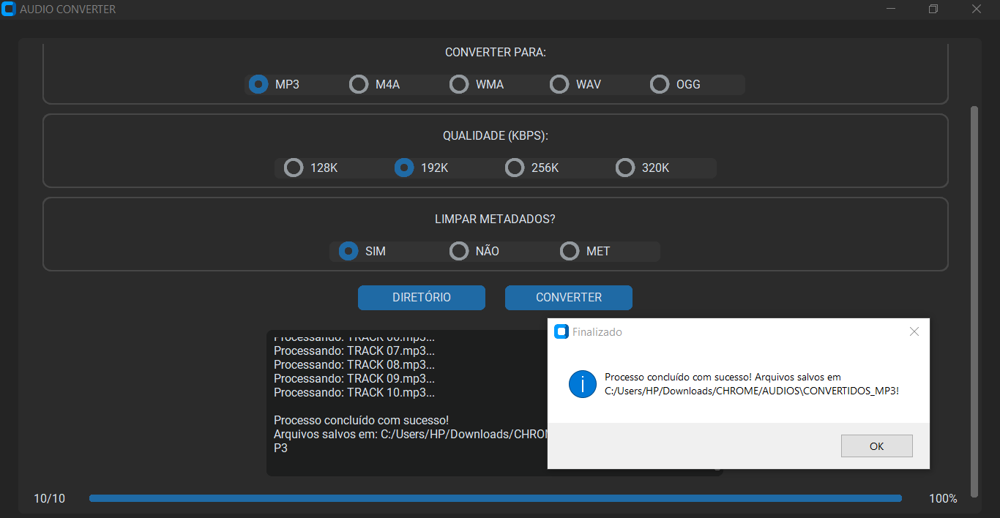
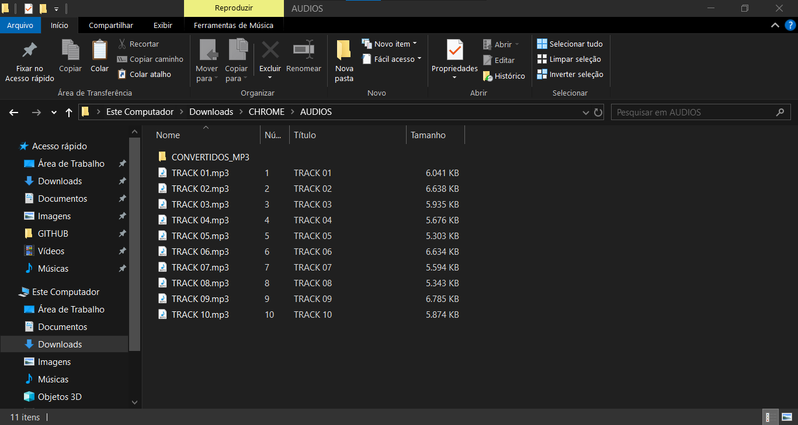
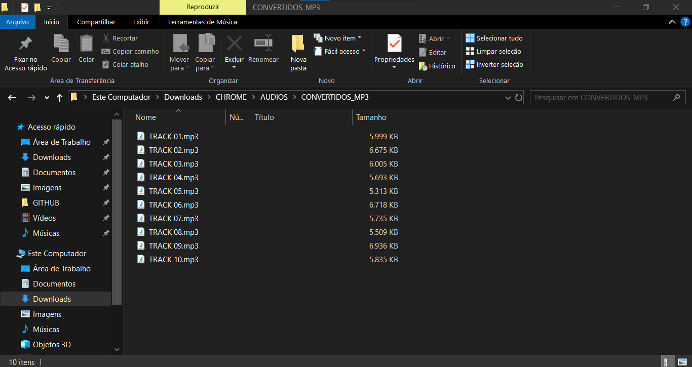

# AUDIO CONVERTER
📱USE ESTE APLICATIVO PARA CONVERTER ARQUIVOS DE ÁUDIO (PARA: "MP3", "M4A", "WMA", "WAV" E "OGG") E/OU REMOVER METADADOS DE FORMA SIMPLES USANDO O FFMPEG.

 <br>
 <br>
 <br>

## DESCRIÇÃO:
* Este aplicativo converte automaticamente arquivos de áudio de diversos formatos (como `.mp3`, `.wav`, `.ogg`, `.flac`, `.aac`, `.m4a`, `.wma`, `.alac`, `.opus`, `.mp4`, `.mov` e `.webm`) para um formato de saída escolhido pelo usuário, utilizando a poderosa ferramenta `ffmpeg`.

* É especialmente útil para tornar arquivos compatíveis com qualquer dispositivo de áudio — como aparelhos antigos, carros, players portáteis e celulares que aceitam apenas formatos tradicionais.

## FUNCIONALIDADES:
* **Interface gráfica moderna (tema escuro)** desenvolvida com `customtkinter`.
* **Executa em tela maximizada** e permite redimensionamento da janela.
* **Seleção de diretório** contendo os arquivos de áudio.
* **Escolha do formato de saída** entre: `MP3`, `M4A`, `WMA`, `WAV` e `OGG`.
* **Controle da qualidade de áudio (kbps)**, com opções de `128K`, `192K` (padrão), `256K` e `320K`.
* **Preservação ou remoção de metadados**, com possibilidade de conversão mesmo quando o formato de entrada e saída é o mesmo.
* **Botões de seleção de formato e qualidade exibidos horizontalmente**, centralizados em contêineres elegantes.
* **Opção para limpar metadados** dos arquivos convertidos, útil para remover informações como artista, álbum ou comentários embutidos.
* **Conversão automática**, inclusive de arquivos `.mp3` modernos que podem não ser compatíveis com todos os dispositivos.
* **Criação automática de uma pasta `CONVERTIDOS_<FORMATO>`** para salvar os arquivos convertidos.
* **Área de status com logs em tempo real**, mostrando mensagens de processamento e progresso da conversão.
* **Mantém a mensagem do diretório selecionado visível** mesmo após limpar o campo de status.
* **Exibição do caminho de saída ao final da conversão**, informando onde os arquivos foram salvos.
* **Mensagens de erro e alertas amigáveis**, caso nenhum arquivo válido seja encontrado ou o diretório não tenha sido selecionado.
* **Barra de progresso com contagem de arquivos convertidos e percentual concluído**, facilitando o acompanhamento visual do processo.

## SOBRE OS BOTÕES DE QUALIDADE (KBPS):
* **128K (\~3,4 a 4,6 MB em 4 min)** → Qualidade **básica/aceitável**. Apresenta artefatos metálicos, perda de definição nos agudos e graves levemente abafados.
* **192K (\~6,9 MB em 4 min)** → Qualidade **boa e equilibrada**. Distorsões discretas, mantendo nitidez satisfatória em músicas e vozes. É o padrão indicado para uso geral.
* **256K (\~9,2 MB em 4 min)** → Qualidade **muito boa**, próxima da máxima. Preserva riqueza sonora e dinâmica, ideal para quem busca alta fidelidade sem gerar arquivos tão grandes quanto em `320K`.
* **320K (\~11,5 MB em 4 min)** → Qualidade **excelente**, comparável à de um CD. Praticamente transparente ao ouvido humano, mas com maior consumo de espaço em disco.

**Observação:** É possível converter de uma taxa maior para uma menor, por exemplo de **320K para 128K**, o que resulta em arquivos menores, mas inevitavelmente com **perda de qualidade**. No entanto, o processo inverso — converter de **128K para 320K** — não recupera a qualidade original; apenas gera arquivos maiores, mantendo as limitações do áudio de origem.

## SOBRE OS BOTÕES DE LIMPAR METADADOS:
* **SIM:**
  * Função: Converte o áudio para o formato escolhido **e remove os metadados**.
  * Uso típico: Quando você quer que o arquivo final seja convertido e não contenha nenhuma informação extra, como título, artista ou capa.

* **NÃO:**
  * Função: Converte o áudio para o formato escolhido **e preserva os metadados**.
  * Uso típico: Quando você quer manter todas as informações originais do arquivo, mesmo após a conversão.

* **MET:**
  * Função: **Não converte o formato** do arquivo (mantém a extensão original) e **remove os metadados**.
  * Uso típico: Quando você quer apenas limpar os metadados de um conjunto de arquivos sem alterar o formato de áudio.

  * **Como fazer o botão **MET** aparecer?**
   1. O botão só aparece quando **todos os arquivos no diretório selecionado têm a mesma extensão que o formato atualmente selecionado**.
   2. Por exemplo, se você selecionou arquivos `.mp3` e o formato escolhido também for `MP3`, o botão `MET` ficará visível.
   3. Se houver arquivos de diferentes formatos ou se o formato escolhido não corresponder à extensão dos arquivos, o botão `MET` desaparecerá automaticamente.

## COMO USAR?
1. **Instale as bibliotecas necessárias:** Antes de executar o app, certifique-se de instalar todas as dependências necessárias. No terminal, execute o seguinte comando para instalar as dependências listadas no arquivo requirements.txt em `CODIGO`:
   ```bash
   pip install -r requirements.txt
   ```

2. **Instalar `ffmpeg`:** O App depende da ferramenta externa chamada `ffmpeg` para converter os arquivos de áudio.

   1. **Baixar `ffmpeg`:**
      - Vá para o site oficial: [https://ffmpeg.org/download.html](https://ffmpeg.org/download.html).
      - Na seção de downloads, clique em "Windows builds from gyan.dev" ou um equivalente.
      - Baixe o arquivo ZIP de uma versão estável, por exemplo: `ffmpeg-git-full.7z`.

   2. **Extrair o `ffmpeg`:**
      - Extraia o conteúdo do arquivo baixado para uma pasta em seu computador, como `C:\ffmpeg`.

   3. **Adicionar `ffmpeg` ao caminho (PATH):**
      - Abra o **Painel de Controle** e vá para **Sistema e Segurança** > **Sistema** > **Configurações avançadas do sistema**.
      - Clique em **Variáveis de Ambiente**.
      - Em **Variáveis de Sistema**, selecione a variável **Path** e clique em **Editar**.
      - Adicione uma nova entrada com o caminho completo para a pasta `bin` dentro da pasta onde você extraiu o `ffmpeg`, por exemplo: `C:\ffmpeg\bin`.
      - Clique em **OK** e feche as janelas.

   4. **Verificar a instalação:**
      - Abra o Prompt de Comando e digite `ffmpeg` para verificar se está funcionando corretamente. Você deve ver uma lista de comandos suportados se tudo foi configurado corretamente.

3. **Executar o APP:**
   * No diretório `./CODIGO`, execute o aplicativo com o comando:

   ```bash
   python CODIGO.py
   ```

4. A janela abrirá automaticamente **maximizada**.

5. Clique no botão **"DIRETÓRIO"** e selecione a pasta que contém os arquivos de áudio que deseja converter. O caminho selecionado será exibido na caixa de status e permanecerá visível durante todo o processo.

6. Escolha o **formato de saída desejado** entre as opções disponíveis (`MP3`, `M4A`, `WMA`, `WAV` e `OGG`), utilizando os **botões exibidos horizontalmente na área “CONVERTER PARA:”**.

**7. Selecione a **qualidade de áudio (kbps)** desejada** entre as opções disponíveis (`128K`, `192K`, `256K` e `320K`), utilizando os **botões exibidos horizontalmente na área “QUALIDADE (KBPS):”**.

8. Na seção **"LIMPAR METADADOS?", escolha entre as opções:** **SIM** (remove os metadados e converte o áudio), **NÃO** (mantém os metadados e converte) ou **MET** (remove os metadados sem alterar o formato original; esse botão só aparece quando todos os arquivos têm a mesma extensão que o formato selecionado).

9. Clique no botão **"CONVERTER"** para iniciar a conversão. Os logs anteriores serão limpos, mas o diretório selecionado permanecerá visível.

10. Acompanhe o processo na **caixa de status**, que exibe logs em tempo real do `ffmpeg`, incluindo os nomes dos arquivos sendo processados e qualquer mensagem relevante.

11. Ao final, uma mensagem de confirmação será exibida, **indicando o sucesso da conversão e o caminho da pasta de saída**.

12. Os arquivos convertidos estarão em uma subpasta chamada **`CONVERTIDOS_<FORMATO>`** (por exemplo, `CONVERTIDOS_MP3`), criada automaticamente dentro do diretório selecionado.

## SOBRE O EXECUTAVEL E O INSTALADOR:
### 1. EXECUTANDO O INSTALADOR:
   * O instalador está localizado no diretório `./APP` e está disponível apenas para sistemas **Windows x64**. Para realizar a instalação, basta **dar dois cliques no arquivo** e seguir as instruções exibidas na tela.
   * **Observação:** Certifique-se de que o `ffmpeg` esteja instalado e adicionado à variável de ambiente PATH do sistema para que o aplicativo funcione corretamente.

### 2. GERANDO O EXECUTAVEL:
> **IMPORTANTE:** Antes de criar o instalador, é necessário gerar o arquivo `AUDIO CONVERTER.exe`. Para isso, siga os passos abaixo:

   **1. Instalação do PyInstaller:**
   * Certifique-se de ter o PyInstaller instalado. Se não tiver, instale usando o comando abaixo:
   ```bash
   pip install pyinstaller
   ```

   **2. Gerando o Executável:**
   * No diretório `./CODIGO`, utilize o comando abaixo para gerar o executável:

   ```bash
   pyinstaller EXECUTAVEL.spec
   ```

   * O executável `AUDIO CONVERTER.exe` será criado na pasta `./CODIGO/dist`.
   * Após a geração, você pode excluir a pasta `./CODIGO/build`.

### 3. GERANDO O INSTALADOR:
#### PASSO 1: BAIXAR E INSTALAR O INNO SETUP:
1. **Download**: Baixe o Inno Setup do site oficial: [Inno Setup](http://www.jrsoftware.org/isdl.php).
2. **Instalação**: Siga o assistente de instalação para instalar o Inno Setup no seu sistema.

#### PASSO 2: CRIAR O INSTALADOR:
> **IMPORTANTE:** Antes de criar o novo instalador, certifique-se de excluir o arquivo `./APP/AUDIO CONVERTER.exe`.

1. **Editar o arquivo do instalador:**
   * No diretório `./CODIGO`, abra o arquivo `INSTALADOR.iss` e atualize o seguinte trecho:

   * Localize a diretiva `#define Diretorio` e substitua pelo caminho correto do diretório do projeto. Exemplo:

     ```ini
     #define Diretorio "C:\Users\HP\Downloads\GITHUB\REPOSITORIO\02-PROJETOS PUBLICOS\02-APLICATIVOS\AUDIO CONVERTER\CODIGO"
     ```

2. **Gerar o instalador no Inno Setup:**
   * Abra o arquivo `./CODIGO/INSTALADOR.iss` com o **Inno Setup**.
   * Clique em **"Compile"** para gerar o instalador.

3. **Limpar arquivos temporários:**
   * Após a criação do instalador, você pode excluir o executável temporário `./CODIGO/dist/AUDIO CONVERTER.exe`.

4. **Instalando o Aplicativo:**
   * Se o `Aplicativo` não iniciar automaticamente a instalação, você pode executar manualmente o arquivo `./APP/AUDIO CONVERTER.exe` clicando duas vezes sobre ele.
   * O assistente de instalação será iniciado e, por padrão, o aplicativo será instalado no seguinte caminho: `C:\Program Files\AUDIO CONVERTER`.

## NÃO SABE?
- Entendemos que para manipular arquivos em muitas linguagens e tecnologias, é necessário possuir conhecimento nessas áreas. Para auxiliar nesse aprendizado, oferecemos cursos gratuitos e alguns subsídios:
* [CURSO DE PYTHON](https://github.com/VILHALVA/CURSO-DE-PYTHON)
* [CURSO DE CUSTOMTKINTER](https://github.com/VILHALVA/CURSO-DE-CUSTOMTKINTER)
* [CONFIRA MAIS CURSOS](https://github.com/VILHALVA?tab=repositories&q=+topic:CURSO)
* [DOCUMENTAÇÃO OFICIAL DO PYINSTALLER](https://pyinstaller.org/en/stable/)
* [DOCUMENTAÇÃO OFICIAL DO INNO SETUP](http://www.jrsoftware.org/isinfo.php)

## CREDITOS E MAIS:
- [PROJETO CRIADO PELO VILHALVA](https://github.com/VILHALVA)
- [CLIQUE AQUI PARA VER O HISTÓRICO DE ATUALIZAÇÕES](./UPDATES.md)
